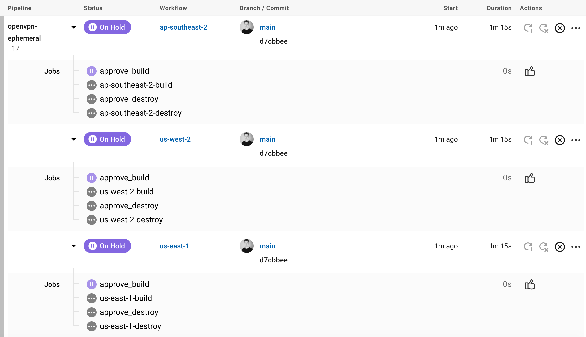
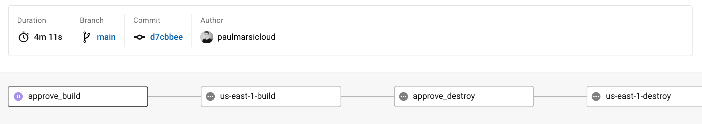
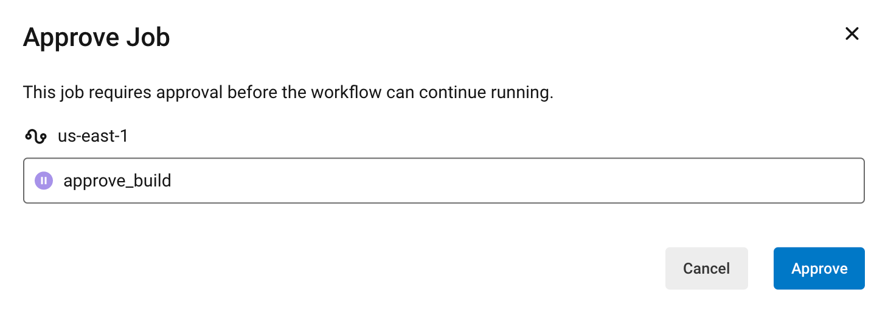
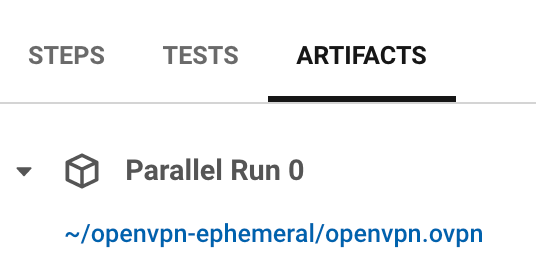

# OpenVPN Ephemeral CircleCI Template

## Overview
This repo provides an example template that supports a CircleCI pipeline building and destroying an OpenVPN EC2 server on demand. This template makes use of the [paulmarsicloud/openvpn-ephemeral/aws](https://registry.terraform.io/modules/paulmarsicloud/openvpn-ephemeral/aws/latest) Terraform Module.

## Pre-requisites
In order to utilize this template repo, you will need an AWS Account with an IAM user that has programmatic access, and OpenVPN Connect on your local machine.

## Environment Variables
In order to use this template, simply clone/fork this repo, authorize CircleCI and update the following
1. The `TF_VAR_public_ip: <REPLACE ME>` variable in the [config.yml](/.circleci/config.yml) file with your local public IP address (e.g. `curl 4.ipaddr.io`)
2. In CircleCI go to Project Settings > Environment Variables > Add environment variables for your `AWS_ACCESS_KEY_ID` and `AWS_SECRET_ACCESS_KEY_ID`

## Start/Stop OpenVPN Ephemeral Server
1. When ready to use OpenVPN, go to CircleCI > Projects > select your repo > choose your `main` branch and hit Run Pipeline
2. Click on the region name listed under Workflow for the region you want to use:

3. Click the `approve_build` job to manually approve the build job:

4. Wait for the `<region>-build` job to complete
5. When completed, click on the job and go to Artifacts > download `openvpn.ovpn` file to your local machine: 

6. Open `openvpn.ovpn` on your local machine with your OpenVPN Connect application
7. When ready to destroy, simply disconnect from the OpenVPN Connect profile, go back to the Workflow in CircleCI for your region. Click the `approve_destroy` job to manually approve the destroy job.
